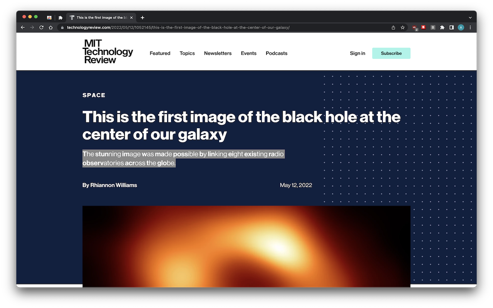
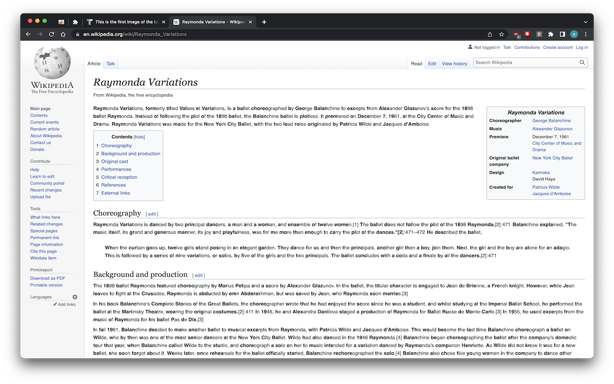

# Bionic Text Extension

## UI


###  Example A in action (MIT Technology Review)



###  Example B in action (Wikipedia)



## Description

A new concept called "Bionic Reading" aims to increase readability of text for humans.

This extension converts text on-the-fly into Bionic Text. The goal of this extension is partly to measure and adapt the techniques around this, probably on an individual basis, because the original author of this plugin believes that the value of this technique is highly dependent upon a number of factors which must increase legibility of text.

## Development

If you're a developer and would like to contribute, you are (probably!) welcome!

For now, if you contact me directly or file a [sensible] issue on the repo, you may well be invited to join the project as a "core" or "ephemeral" contributor.

## Get started

Clone this repo:

```zsh
git clone https://github.com/Quasso/bionic-Text-extension.git;
cd bionic-Text-extension
```

The following two commands assume that you have a valid/supported version of Node.js and `npm` installed in your current shell session.

If you do not already have a version manager for Node installed, I recommend: https://github.com/tj/n

If you do already have `n` installed, simply run:

```zsh
n latest
```

If that fails (due to some major change, for example):

```zsh
n install 18.2.0 # last known working version in docs
```

Open this project in your favourite editor via terminal (`code .`), then run:

```zsh
npm install; npm run build
```

From your terminal (at the root of this project!).

Next, if you are viewing this repo from your Chrome browser, click below to navigate to the extensions page:

[chrome://extensions](chrome://extensions)

Alternatively, copy the following address and paste it into Chrome:

```zsh
chrome://extensions/
```

Next, toggle "Developer mode" in the top right hand corner.

Finally, click the "Load unpacked" button on the left hand side of the page. Navigate to your copy of this repository, specifically the `./dist` dir.

## Official Published Extension

Coming very soon! It has been submitted for approval as of 26 May. Once it's live I will update the repo with a link to the install page :)

## With <3 from Alex

Thanks for checking this out. I did hack this together quickly on a Saturday for the first working version but have tidied things up, experimented with ideas and refactored/enhanced things a lot since then prior to publishing v1.0.0. If you like it, I'm delighted!

Please feel free to fork this repository and strip it back to create your own Chrome extensions if you think it a worthy baseline! The webpack config will need modifying to support new use cases but this can be improved. I just made it work with this quite practically so far.

### Final note

I did this purely for fun, and to try out the new V3 Manifests in Chrome extensions. I have since done a bit of research and realised that there is some existing--very good--tooling/info built around this.

For that reason, as an alternative which removes all the styling, I would suggest checking out the "Bionic Reading" extension too.

This extension is not developed by Bionic Reading 